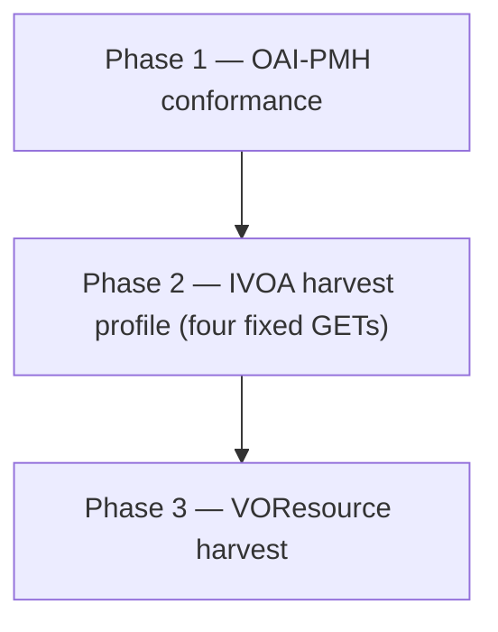

# Benson documentation

Documentation for the IVOA **Registry of Registries** validator: checking publishing-registry **OAI-PMH** endpoints, validating harvested **VOResource** records, and serving Benson’s own registry catalog over OAI.

The [project README](../README.md) covers how to run Benson, environment variables, and Docker. This folder holds the **behavioural contract**, **asset layout**, **parity fixtures**, and **legacy Java** maintainer notes.

---

## Validation approach

Registry validation has two independent capabilities:

| Capability | Input | Output |
|------------|-------|--------|
| **Harvest validation** | An OAI-PMH base URL (`endpoint`) for a publishing registry | Structured XML/JSON/HTML reports across three sequential phases |
| **Standalone VOResource validation** | One or more VOResource XML files (upload or HTTP URL) | Per-record schema and rule results |

### Harvest pipeline (three phases)

Harvest validation runs **in order**. Each phase must complete before the next begins.

**Phase 1 — Standard OAI-PMH.** A large matrix of HTTP requests against the target `endpoint` (Identify variants, illegal arguments, ListMetadataFormats, ListSets, ListIdentifiers permutations, and similar). Historically driven by the **OAI Repository Explorer** (`comply` binary or a remote explorer URL). Results appear under an **`OAIValidation`** XML root with **`testQuery`** / **`test`** children.

**Phase 2 — IVOA harvesting profile.** Four fixed OAI GETs appended to `endpoint`:

| Step | `verb` | Extra parameters |
|------|--------|------------------|
| 1 | `Identify` | — |
| 2 | `ListMetadataFormats` | — |
| 3 | `ListSets` | — |
| 4 | `ListRecords` | `metadataPrefix=ivo_vor`, `set=ivo_managed` |

Responses are optionally checked with **bundled XSDs** (when built-in schemas are enabled) and **XSLT** (`checkIVOAOAI.xsl`). Aggregated results use a **`HarvestValidation`** root.

**Phase 3 — VOResource compliance.** Records are harvested from ListRecords-style OAI output (including resumption semantics). Each extracted resource is validated with **W3C XML Schema** and **XSLT** (`checkVOResource.xsl`). A merged summary uses **`RegistryValidation`** with aggregated pass/fail/warn counts.

### Schema and rule layers

When **built-in XSD schemas** are enabled (`builtinSchemas` on the legacy API, or the “Use built-in XSD schemas” checkbox in Benson’s UI), validation uses the offline catalog under [`assets/schemas/`](../assets/schemas/):

1. **Embedded OAI payloads** (`description`, `metadata`, `about`) are validated against the appropriate IVOA XSDs. Registry Interface records use [`benson-ivoa-bundle.xsd`](../assets/schemas/benson-ivoa-bundle.xsd) so `xsi:type` extensions such as `vg:Registry` resolve.
2. The **OAI-PMH envelope** is then validated via [`benson-oai-bundle.xsd`](../assets/schemas/benson-oai-bundle.xsd).

Imports resolve locally (no network). Validating against `OAI-v2.xsd` alone is not sufficient for registry `Identify` responses that embed `ri:Resource` metadata.

**XSLT stylesheets** in [`assets/validate/`](../assets/validate/) express IVOA **business rules** beyond XSD (profile tests in phase 2, VOR constraints in phase 3). Standalone VOR upload validation **always** uses the bundled XSD catalog, independent of the harvest `builtinSchemas` flag.

Full asset layout, namespace map, and developer extension notes: [schemas-and-validation-assets.md](schemas-and-validation-assets.md).

### Discovery and parity

External documentation for this service has been sparse. Treat **`http://rofr.ivoa.net`**, **this codebase**, and **[`docs/samples/`](samples/)** captures as a composite reference. Prefer **parity tests** (against production or a faithfully deployed legacy WAR, plus the checked-in sample bodies) wherever prose is ambiguous; document any intentional divergence in [regvalidate-parity-notes.md](regvalidate-parity-notes.md).

---

## OAI endpoints

“OAI endpoints” appear in two roles in this project.

### 1. Target registry endpoints (what you validate)

The harvest validator takes a publishing registry’s **OAI-PMH HTTP GET base URL** as the query parameter **`endpoint`** (not `baseURL`). It must allow appending `verb=…` and other OAI parameters; the reference implementation expects **`endpoint` to end with `?` or `&`**.

Example: `https://example.org/reg/oai?`

Benson and the legacy servlet issue many HTTP requests against this URL during phases 1–3. Session state, operation catalogue (`op=StartSession`, `op=Validate`, `op=ValidateOAI`, and so on), and response formats are specified in [regvalidate-functional-contract.md](regvalidate-functional-contract.md).

### 2. Benson’s own OAI catalog (what Benson serves)

Benson also **publishes** registry metadata over OAI-PMH for the Registry of Registries and related catalogues:

| Method | Path | Role |
|--------|------|------|
| GET | `/oai` | IVOA standards catalog from [`assets/standards/`](../assets/standards/) (`metadataPrefix=ivo_vor`, `set=ivo_managed`) |
| GET | `/list-publishers` | Registered publishing registries as OAI XML (from [`data/publishers/`](../data/publishers/)) |

These are **catalog sources**, not the URLs submitted to the harvest validator. Environment variables `STANDARDS_DIR`, `OAI_REPOSITORY_NAME`, `OAI_REGISTRY_IDENTIFIER`, and related settings control how `/oai` identifies itself; see the [project README](../README.md).

### HTTP surface — Benson (current)

| Method | Path | Description |
|--------|------|-------------|
| GET, POST | `/validator`, `/regvalidate` | Async harvest validation form |
| POST | `/validator/jobs` | Start validation job (JSON) |
| GET | `/validator/jobs/{run_id}` | Job status |
| GET | `/validator/jobs/{run_id}/result` | HTML result view |
| GET, POST | `/api/v1/registry-validate/harvest` | Harvest validation API (legacy-compatible session model) |
| POST | `/api/v1/registry-validate/voresource` | Standalone VOResource validation ([README § Standalone VOResource](../README.md#standalone-voresource-validation)) |
| GET | `/api/v1/registry/publishers` | Publishers registry (JSON) |

### HTTP surface — legacy Java WAR (posterity)

The original **Ant/Ivy/Tomcat WAR** (`ivoaharvest`, `dalvalidate`) is retained in the repository for historical reference only. **You can largely ignore this section** when working on Benson: the Python service is the maintained implementation, and the functional contract describes behaviour without assuming Java.

The table below documents the old servlet paths for parity testing against `http://rofr.ivoa.net` or when reading archived sample captures—not for day-to-day development.

| Resource | Role |
|----------|------|
| `/regvalidate/HarvestValidater` | Session-based harvest / OAI validation |
| `/regvalidate/VOResourceValidater` | Synchronous VOResource check (`POST` multipart) |

Build, servlet mapping, and deployment (maintainer archaeology): [regvalidate-legacy-java-deployment.md](regvalidate-legacy-java-deployment.md).

---

## Document index

| Document | What it explains |
|----------|------------------|
| [**regvalidate-functional-contract.md**](regvalidate-functional-contract.md) | **Normative behaviour** for a rewrite: HTTP surface, session/`runid` model, `op` catalogue, three validation phases, `builtinSchemas`, namespace-to-XSD map, XSLT roles, live response shapes, and related IVOA standards links. Start here when implementing or comparing behaviour. |
| [**schemas-and-validation-assets.md**](schemas-and-validation-assets.md) | **Developer guide** to bundled XSDs ([`assets/schemas/`](../assets/schemas/)), XSLT rules ([`assets/validate/`](../assets/validate/)), standards records ([`assets/standards/`](../assets/standards/)), and how each validation phase uses them. Includes bundle composition, namespace table, and how to extend schemas. |
| [**regvalidate-parity-notes.md**](regvalidate-parity-notes.md) | **Edge cases and intentional quirks** when matching the legacy deployment: phase 3 iterator limits, sync vs background `maxVORInclude`, pseudo-JSON quoting, HTTP 500 paths, OAI Explorer dependence, and result XML without a published wrapper XSD. |
| [**regvalidate-legacy-java-deployment.md**](regvalidate-legacy-java-deployment.md) | **Posterity only** — Ant/Ivy/Tomcat WAR build and deployment notes (`ivoaharvest`, `dalvalidate`). Ignore unless you need to inspect or reproduce the old Java stack. |
| [**regvalidate-api.md**](regvalidate-api.md) | Short **quick-reference index** (subset of this README) with direct links into the functional contract sections. |
| [**samples/README.md**](samples/README.md) | Overview of **HTTP response fixtures** for parity testing and onboarding. |
| [**samples/harvest-validater/README.md**](samples/harvest-validater/README.md) | **`HarvestValidater`** sample files: `StartSession`, `ValidateOAI` / `ValidateIVOA` XML, `GetStatus` JSON, and replay notes (`JSESSIONID`, pseudo-JSON). |
| [**samples/harvest-validater/CAPTURE.md**](samples/harvest-validater/CAPTURE.md) | **`curl`** steps to refresh harvest-validater samples from a live deployment. |
| [**samples/voresource-validater/README.md**](samples/voresource-validater/README.md) | **`VOResourceValidater`** multipart POST sample and replay command. |

---

## Suggested reading order

1. **Implementing or testing Benson** — [regvalidate-functional-contract.md](regvalidate-functional-contract.md) §2–3, then [schemas-and-validation-assets.md](schemas-and-validation-assets.md).
2. **Matching legacy output** — [samples/](samples/), [regvalidate-parity-notes.md](regvalidate-parity-notes.md), and contract §8.
3. **Legacy Java archaeology (optional)** — [regvalidate-legacy-java-deployment.md](regvalidate-legacy-java-deployment.md); only if you need the old WAR layout for parity or historical context.
