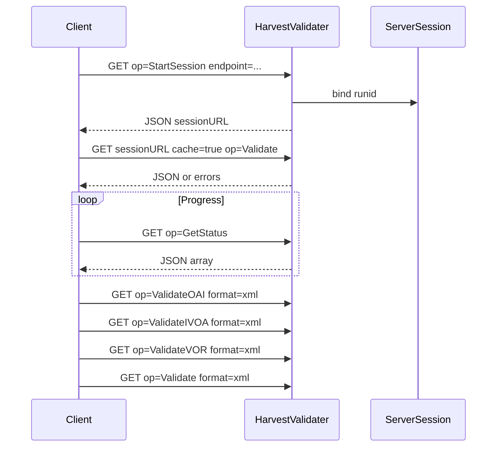
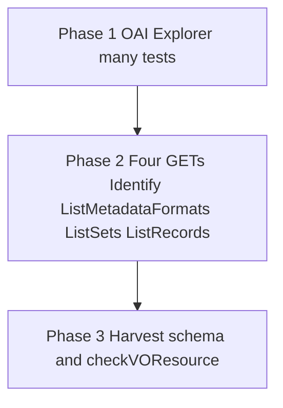
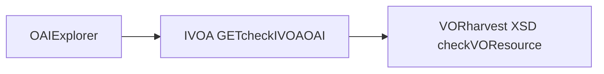

# Registry validate — functional contract (rewrite)

Language-neutral specification for replacing the **harvest registry validator** and **standalone VOResource validator** without assuming Java, Ant, or Tomcat. For how the current WAR is built and deployed, see [regvalidate-legacy-java-deployment.md](regvalidate-legacy-java-deployment.md). Parity quirks and golden samples live in [regvalidate-parity-notes.md](regvalidate-parity-notes.md) and [samples/](samples/).

**Normative local XSD set for schema validation:** [`assets/schemas/`](../assets/schemas/) (OAI 2.0, Dublin Core, OAI-DC, toolkit, and IVOA registry extension schemas). Namespace-to-file mapping matches `ivoaharvest/src/main/resources/net/ivoa/registry/validate/registrySchemaLocation.txt` in this repository and [`src/benson/xml/catalog.py`](../src/benson/xml/catalog.py). Documented in [schemas-and-validation-assets.md](schemas-and-validation-assets.md).

Because external documentation has been scarce, **`http://rofr.ivoa.net`**, **this codebase**, and the **`docs/samples/`** captures form a composite reference. Prefer **parity tests** (against production or a reproduced deployment, plus sampled bodies in **`docs/samples/`**) wherever the prose here is ambiguous; document any intentional divergence.

---

## 1. Scope

The service provides two capabilities:

1. **Harvest validation (`HarvestValidater`):** Given an OAI-PMH base URL (`endpoint`), run **OAI-PMH conformance checks**, then **IVOA registry harvesting profile checks** (fixed four HTTP GETs), then **VOResource** checks on records obtained from OAI list/harvest behavior.
2. **Standalone VOR validation (`VOResourceValidater`):** Accept uploaded or URL-fetched VOResource XML and return validation results (schema + XSLT rules).

---

## 2. HTTP surface (compatibility)

**Base path:** `/regvalidate`

| Resource | Role |
|----------|------|
| `/regvalidate/HarvestValidater` | Session-based harvest / OAI validation (RofR “Step 1”). |
| `/regvalidate/VOResourceValidater` | Synchronous single- or multi-record VOResource check. |

The reference UI also serves static pages (e.g. harvest and VOR forms) at the WAR root; replacements may use any front end as long as the HTTP contract below is honored if clients must stay compatible.

### 2.1 Harvest validator — session and query model

- **Methods:** `GET` and `POST` are acceptable; the historical UI uses **`GET`** with a query string for all steps.
- **Session:** A server-side session (cookie **`JSESSIONID`**) holds validation state. The query parameter **`runid`** identifies which validation run to resume.
- **Query parsing:** Parameter **`op`** selects the operation. **`runid`** is reserved; when building a “replay” query string for the client, **`runid`** and **`op`** are typically omitted from the stored copy. Duplicate parameter names are merged (space-separated) in the reference implementation.
- **First request (no `runid`):** The client must supply **`endpoint`** (see §2.2). The server creates a new run and returns a **`runid`**. It also supplies a continuation base URL (e.g. servlet path + `?runid=<id>&`) for follow-up requests.
- **Session URL encoding:** Some containers append **`;jsessionid=...`** to URLs when cookies are not used. Clients should send the session cookie when possible.

**Required query name:** **`endpoint`** (not `baseURL`).

### 2.2 Parameter: `endpoint`

- **Meaning:** OAI-PMH **HTTP GET** base URL for the publishing registry.
- **Format:** Must allow appending `verb=…` and other OAI parameters. The reference implementation validates by dropping the **last character** and parsing the remainder as a URL, so **`endpoint` should end with `?` or `&`**.
- **Example:** `https://example.org/reg/oai?`

### 2.3 Optional harvest parameters

| Parameter | Meaning |
|-----------|---------|
| **`builtinSchemas`** | If **present** (e.g. `builtinSchemas=y`), XML schema validation uses the **bundled/catalog** XSD set ([`assets/schemas/`](../assets/schemas/) and the namespace map in §5). Applies to OAI responses in phase B and harvested VOResource in phase C. If **absent**, the reference implementation disables that fixed catalog (network or resolver-dependent behavior). |
| **`cache`** | For `op=Validate`, **`cache=true`** kicks off asynchronous validation and returns JSON with a **`resultURL`** (or equivalent) rather than blocking until complete. |
| **`format`** | Result encoding: **`html`**, **`xml`**, **`text`**, **`json`**. Errors and status JSON may use **`application/jsonrequest`** in the legacy app. |
| **`errorFormat`** | Hint for error documents: `html` / `xml` / `text` / `json`. |
| **`show`** | Space-separated tokens controlling which result severities appear in XML roots (e.g. `fail`, `warn`, `rec`, `pass`) — echoed as **`showStatus`** on result elements when applicable. |

### 2.4 Operations: `op`

| `op` | Behavior |
|------|-----------|
| **`StartSession`** | Returns JSON including a **`sessionURL`** fragment with `runid=` and echoed `endpoint=` for subsequent GETs. |
| **`Validate`** | With **`cache=true`**, start background work; return JSON (`status`, `resultURL`). Otherwise run full pipeline synchronously up to **`maxVORInclude`** (reference: **5** for synchronous path, **1** for background-cache path). Default result **`format`** in reference: **HTML** unless overridden. |
| **`GetStatus`** | Returns a **JSON array** of progress objects (OAI / IVOA / VOR steps). |
| **`ValidateOAI`** | OAI Explorer phase results only (`format` often **xml**). |
| **`ValidateIVOA`** | Four fixed OAI GET validations + `checkIVOAOAI` results. |
| **`ValidateVOR`** | VOResource harvest validation summary. |
| **`GetResource`** | **`id`** — return cached extracted record (**`format`**, often **xml**). |
| **`ValidateResource`** | **`id`** — validate one cached record. |
| **`Register`** | Server proxies configured **`registerURL`** + **`runid`** (CGI elsewhere). |
| **`Cancel`** | Interrupt; JSON response. |

If **`op`** is omitted after session init, the reference behavior invokes **`Validate`** synchronously.

### 2.5 HTTP errors (reference behavior)

| Status | Typical cause |
|--------|----------------|
| **409** | Session unavailable or conflict resetting state. |
| **400** | Bad or unknown operation / parameters. |
| **500** | Validation or internal failure. |

Missing query string: **400**-class or servlet error (“Missing arguments”).

### 2.6 Reference interaction sequence



---

## 3. OAI endpoint verification steps

Runs in **three phases** sequentially (OAI conformance, then IVOA fixed GETs, then VOR).

### Phase 1 — Standard OAI-PMH

Use **OAI Repository Explorer** tooling: either a **local `comply` binary** (or equivalent path in config template) **or** a **remote explorer URL** (see `ivoaharvest/.../WebAppValidateHarvest.xml.in`, block `testQuery name="oaiexplorer"`).

**Effect:** Issues **many** HTTP requests against `endpoint` (Identify variants, illegal args, ListMetadataFormats, ListSets, ListIdentifiers permutations, etc.). Results historically appear under root **`OAIValidation`** with child **`testQuery`** elements (`name`, `options`, **`test`** children with **`item`** / **`status`**).

### Phase 2 — IVOA harvesting profile (four fixed GETs)

Append each snippet to **`endpoint`**, preserving the **`endpoint + '?' + query`** pattern used by the legacy HTTP GET tester.

Exact strings are authored in **`WebAppValidateHarvest.xml.in`** under `<testQuery name="httpget" type="httpget">` (queries only; deployment copies may rewrite unrelated `baseURL` placeholders).

| Step | `verb` | Extra parameters |
|------|--------|------------------|
| 1 | `Identify` | — |
| 2 | `ListMetadataFormats` | — |
| 3 | `ListSets` | — |
| 4 | `ListRecords` | `metadataPrefix=ivo_vor`, `set=ivo_managed` |

**Processing:** Optionally **schema-validate** responses when **`builtinSchemas`** mode is on ([`docs/schemas`](schemas/)). Evaluate **XSLT `checkIVOAOAI.xsl`**. Aggregated XML root **`HarvestValidation`** with **`testQuery`** children.

### Phase 3 — VOResource compliance

Harvest / iterate OAI **ListRecords-style** payloads (including resumption semantics as implemented). For each extracted resource XML:

1. **W3C XML Schema** against the catalog ([`docs/schemas`](schemas/) when **`builtinSchemas`** applies to harvest).
2. **XSLT `checkVOResource.xsl`** for additional constraints.

Caches (if implemented) typically use **`voresources/`** (extracted XML), **`vorvalidated/`** (per-record outcomes), summaries **`VORResults.xml`** / **`Results.xml`**.

### Combined document

Merged result root **`RegistryValidation`** with aggregated **`status`**, **`nfail`**, **`nwarn`**, **`nrec`**. Configurable timeout (reference template: **240000** ms).



Pipeline overview:



---

## 4. Standalone VOResource validator

**Endpoint:** `/regvalidate/VOResourceValidater` (legacy Java WAR). Benson serves the same contract at **`POST /api/v1/registry-validate/voresource`** — see the [project README](../README.md#standalone-voresource-validation).

**Supported interaction:** **`POST`** `multipart/form-data`.

| Part / field | Purpose |
|--------------|---------|
| **`record`** | File upload(s); reference default limit **10** files, size limits configurable. |
| **`recordURL`** | Optional space-separated **http(s)** URLs to fetch (**`file:`** must be rejected). |
| **`format`** | **`html`**, **`xml`**, or **`text`**. |
| **`show`** | Severity filter tokens for results (advice-only default when omitted). |

**Schema:** Uses the **same XSD catalog as [`assets/schemas/`](../assets/schemas/)** always (independent of harvest **`builtinSchemas`** flag).

**Legacy quirk:** A **`GET`** handler exists in the Java app but does **not** parse the query string; **only POST is interoperable** unless you deliberately fix GET.

---

## 5. Namespace to schema file mapping

Relative paths resolve under the runtime schema directory (**`assets/schemas/`** in Benson; `SCHEMA_ROOT` env var). The authoritative map in code is [`src/benson/xml/catalog.py`](../src/benson/xml/catalog.py). See also [schemas-and-validation-assets.md](schemas-and-validation-assets.md).

```
http://oai.dlib.vt.edu/OAI/metadata/toolkit schemas/OAItoolkit.xsd
http://www.w3.org/XML/1998/namespace schemas/xml.xsd
http://purl.org/dc/elements/1.1/ schemas/simpledc20021212.xsd
http://www.openarchives.org/OAI/2.0/oai_dc/ schemas/oai_dc.xsd
http://www.openarchives.org/OAI/2.0/ schemas/OAI-v2.xsd
http://www.w3.org/1999/xlink schemas/xlink.xsd
http://www.ivoa.net/xml/STC/stc-v1.30.xsd schemas/stc-v1.xsd
http://www.ivoa.net/xml/VOResource/v1.0 schemas/VOResource-v1.xsd
http://www.ivoa.net/xml/RegistryInterface/v1.0 schemas/RegistryInterface-v1.xsd
http://www.ivoa.net/xml/VODataService/v1.1 schemas/VODataService-v1.xsd
http://www.ivoa.net/xml/VORegistry/v1.0 schemas/VORegistry-v1.xsd
http://www.ivoa.net/xml/SIA/v1.1 schemas/SIA-v1.xsd
http://www.ivoa.net/xml/SSA/v1.1 schemas/SSA-v1.xsd
http://www.ivoa.net/xml/ConeSearch/v1.0 schemas/ConeSearch-v1.xsd
http://www.ivoa.net/xml/StandardsRegExt/v1.0 schemas/StandardsRegExt-v1.xsd
http://www.ivoa.net/xml/TAPRegExt/v1.0 schemas/TAPRegExt-v1.xsd
http://www.ivoa.net/xml/VOSIAvailability/v1.0 schemas/VOSIAvailability-v1.xsd
http://www.ivoa.net/xml/VOSICapabilities/v1.0 schemas/VOSICapabilities-v1.xsd
http://www.ivoa.net/xml/VOSITables/v1.0 schemas/VOSITables-v1.xsd
```

---

## 6. Stylesheets

Logic and presentation artifacts live in **`ivoaharvest/src/main/resources/net/ivoa/registry/validate/`** in this repo (basename only here):

| File | Role |
|------|------|
| `checkIVOAOAI.xsl` | IVOA OAI profile tests on harvested HTTP GET responses. |
| `checkVOResource.xsl` | VOR constraints beyond XSD. |
| `validationCommon.xsl` | Shared helpers. |
| `testsVOResource-v1_0.xsl` | Additional VOR tests (if used). |
| `Results-Harvest-html.xsl` | Harvest results HTML view. |
| `ResultsFrag-Harvest-html.xsl`, `SummaryFrag-Harvest-html.xsl` | UI fragments for browser transform. |
| `Results-VOResource-html.xsl` | Standalone VOR HTML view. |

---

## 7. External and optional dependencies

- **OAI Explorer / comply:** Phase 1 requires either executable **`comply`** (or deployment-specific path in config template) **or** a remote archive registration URL **`oaiExplorerURL`** concatenated with **`endpoint`** URL encoding.
- **Registration:** **`Register`** proxies an HTTP CGI (`register.pl` deployment); not intrinsic to OAI validation semantics.
- **Reference stack (optional reading):** The Java implementation uses servlet plumbing and NCSA/XML helper libraries described in [regvalidate-legacy-java-deployment.md](regvalidate-legacy-java-deployment.md); a rewrite only needs equivalents for HTTP, XML parsing, XSD, XSLT 1.0, and OAI Explorer invocation.

---

## 8. Live samples (`http://rofr.ivoa.net`)

**Checked-in parity fixtures:** see [**`docs/samples/`**](samples/) (`harvest-validater/` XML and JSON + `voresource-validater/` POST response). Scripts to refresh them: [**CAPTURE.md**](samples/harvest-validater/CAPTURE.md). Behavioural gaps (resumption limits, pseudo-JSON, 500 paths) are summarized in [**regvalidate-parity-notes.md**](regvalidate-parity-notes.md).

The snippets below summarise the **shapes**; files under **`samples/`** are fuller.

### 8.1 `StartSession`

```http
GET /regvalidate/HarvestValidater?endpoint=https%3A%2F%2Fws.cadc-ccda.hia-iha.nrc-cnrc.gc.ca%2Freg%2Foai%3F&op=StartSession&errorFormat=json
```

```text
{ status: 'ready', sessionURL: 'http://rofr.ivoa.net/regvalidate/HarvestValidater;jsessionid=... ?runid=...&endpoint=...&' }
```

### 8.2 `GetStatus` (truncated JSON array)

```text
[ { 'id': '9', 'ok': 'true', 'message': 'OAI validation begun.', 'done': 'false', 'status': 'started', 'query': 'OAI'}, ...
```

### 8.3 `ValidateOAI` (XML fragment)

```xml
<OAIValidation baseURL="https://ws.cadc-ccda.hia-iha.nrc-cnrc.gc.ca/reg/oai?" showStatus="fail warn rec" testCount="54">
  <testQuery name="Identify" options="?verb=Identify" role="oai">
    <test item="summary" status="fail">Operation must be compliant with OAI-PMH standard</test>
  </testQuery>
</OAIValidation>
```

### 8.4 `ValidateIVOA` (XML fragment)

```xml
<HarvestValidation baseURL="https://ws.cadc-ccda.hia-iha.nrc-cnrc.gc.ca/reg/oai?" showStatus="fail warn rec">
  <testQuery name="Identify" options="verb=Identify" role="Identify">
    <test xmlns:xsi="http://www.w3.org/2001/XMLSchema-instance" item="RI3.1.1" status="fail">Service must respond to a legal OAI Identify query.</test>
  </testQuery>
</HarvestValidation>
```

### 8.5 Errors

 **`op=Validate`** may return **HTTP 500** (e.g. OAI `badVerb`); bodies are deployment-specific HTML or XML unless normalized in a rewrite.

### 8.6 Standalone VOR `POST`, `format=xml`

Multipart with field **`record`** carrying a `.xml` VOResource file produces:

```xml
<VOResourceValidation showStatus="fail warn rec">
  <testQuery ... recordName="example.xml">
    <test item="VRvalid" status="fail">Resource record must be compliant with the VOResource schemas.</test>
  </testQuery>
</VOResourceValidation>
```

---

## 9. Related standards

- IVOA Registry Interfaces: https://www.ivoa.net/Documents/latest/RegistryInterface.html  
- OAI-PMH: https://www.openarchives.org/OAI/openarchivesprotocol.html  
- VOResource: https://www.ivoa.net/Documents/latest/VOResource.html  
